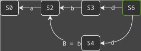
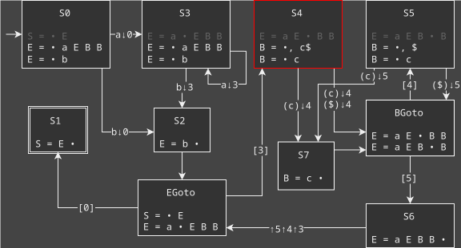

+++
title = "(Right-Nulled) Generalised LR Parsing"
date = "2025-01-12"
taxonomies.tags = ["theory of computation", "automata", "context-free grammar", "pda", "parsing"]
+++

I hope you know a bit about LR parsing, otherwise this blog post won't make much sense to you. You can read all about it in a [previous post of mine](@/lr-parsing-recursive-ascent.md). Today I want to discuss the problems with getting your language parsed in LR(1), or even LR(_k_). And how an old way to solve those problems is with a more powerful algorithm, that can parse _any_ context-free grammar, no restrictions, no complaints about conflicts.

Now in theory, any deterministic[^nondet] context-free language can be parsed with an LR(1) grammar. Writing one might be difficult though. If you can write an LR(_k_) grammar instead, you can mechanically transform it into an LR(1) grammar. But that doesn't necessarily mean that your resulting grammar is _readable_. If it's not very readable, like with any programming artefact, it's going to be a pain in your behind at some point. Because you'll make mistakes, or you'll want to change it, and now you need to understand what's going on again. While you may be able to describe your language within the restrictions of an LR(1) grammar, the _encoding_ required (manual or automatic) will make your grammar less readable. There's a reason why some programming language's manuals have a "high level" or "natural" grammar describing the language and it's intuitive structure, and separately an executable grammar that fits in some grammar class. Another complication is that the output of a parser generated from a grammar follows that grammar. And so, a worse grammar makes for a worse experience using the parser output.

[^nondet]: An example of a non-deterministic context-free language that is also unambiguous is the language of palindromes. And [there are more examples](https://stackoverflow.com/q/13143186).

For these reasons, generalised parsing is a popular prototyping tool, since it allows you to work with the natural grammar. Consider the following two grammars that describe the same language:

|    |    |    |    |    |
| :- | :- | :- | :- | :- |
| $S = E$     | (1) | &emsp;&emsp;&emsp; | $S = E$     | (1) |
| $E = E + T$ | (2) | | $E = E + E$ | (2) |
| $E = T$     | (3) | | $E = E * E$ | (3) |
| $T = T * V$ | (4) | | $E = a$     | (4) |
| $T = V$     | (5) | | | |
| $V = a$     | (5) | | | |

The right one is what I'd call a natural grammar, while the left is a grammar with _encoded_ priority and associativity information. In my opinion, the ideal grammar specification is a natural grammar, with some _separate_ priority and associativity information. Of course without that information, the grammar would be ambiguous, so I do consider it part of the grammar specification. Popular parser generators will have some more or less clunky way of doing this kind of grammar specification for this simple example, but there are always more complicated situations where you must either write your grammar in an unnatural way (encodings), or have to make it accept a superset and do an analysis later[^analysis-later]. And even the latter one it's always an elegant option, check out this example from C++:

[^analysis-later]: Arguably, accepting a superset and doing an analysis in a later stage of your language tool (compiler/interpreter/IDE) can be a _good_ thing. Parser errors are not always the nicest thing to read because they may lack the right context to explain why something isn't acceptable. In Java a `static public void public main()` arguably shouldn't parse, but you can probably give a nicer error message with a custom analysis that checks doubled up keywords and keyword order. 

```cpp
int (a), b, …;
```

Depending on what you put in the …, the above might be a variable declaration list where the parentheses around `a` are superfluous, or it could be a comma-separated list of expressions where the first is a cast to `int`. Variable declaration lists and expressions are two conceptually quite different things in the grammar and in a natural grammar should be separate things. But if you want to deal with this input, you can't use a finite amount of lookahead to distinguish the two[^willink-2001]. So your choice is to make the grammar ugly and complicated or to use a generalised parsing algorithm[^cpp-is-the-worst].

[^willink-2001]: This example is from [_Meta-compilation for C++_, Edward D. Willink's PhD thesis from 2001](https://www.researchgate.net/profile/Edward-Willink-2/publication/2506132_Meta-Compilation_for_C/links/5ee8e7a1458515814a62e32a/Meta-Compilation-for-C.pdf), section 5.2.

[^cpp-is-the-worst]: Even then, C++ is one of those really terrible languages in terms of language design. A generalised parsing algorithm is not going to be enough to parse the language well because _the syntax of C++ is context-sensitive_ 🤯. I've heard about some researchers that tried to make a declarative grammar for C++ through a _data-dependent grammar_, but the grammar turned out ugly anyway. I don't know the details, but I can imagine encoding some terrible things into the data-dependent part to get the right info in the right place to disambiguate.

## An Introduction to Generalised LR Parsing

Let me start by mentioning my source here, it's [_Generalised LR Parsing Algorithms_](https://core.ac.uk/download/pdf/301667613.pdf), the PhD dissertation of Rob Economopoulos. If you want more detail than this blog post gives, or you want to learn more about the history of GLR parsing, I highly recommend spending some time reading that dissertation.

So what's the big idea of Generalised LR Parsing? Well, ambiguous grammars give rise to LR parse table conflicts, right? In GLR, parse table conflicts are no problem: we'll just execute multiple possible actions in parallel on different copies of the parser state. The naive way to do that could give an exponential blowup, so we'll have to be smart about it, by sharing state as much as possible. This will save both memory and work.

Let's work through an example to see how this works. We'll be roughly be following Tomita's Algorithm 1[^tomita-alg-1]. The following grammar is an adaptation of grammar 4.1 from the dissertation:

[^tomita-alg-1]: This refers to [Masaru Tomita's publication _Efficient parsing for natural language: a fast algorithm for practical systems_ from 1986](https://doi.org/10.1007/978-1-4757-1885-0). This is the original GLR publication, which builds up from an LR(1) algorithm as Algorithm 0, Algorithm 1 then works for grammars without epsilon rules, Algorithm 2 is presented as an adaptation that can handle epsilon rules (which it actually doesn't fully), Algorithm 3 is the full recogniser based on Algorithm 2, Algorithm 4 is the parser version that actually creates parse trees instead of just saying yes/no to an input.

| | |
:- | :-
$S = E$   | (1)
$E = abC$ | (2)
$E = aBC$ | (3)
$B = b$   | (4)
$C = de$  | (5)

<div class="gz_dot">


</div>

As you can see, state `S3` has a conflict. To make that clearer, I've added the follow set to rule `B = b •`, which is only `d`. So we have a shift-reduce conflict between that rule and `C = • d e`. Let's see if we can't parse an input of `abde` with this LR automaton and the ideas of GLR. The first part before `S3` should be easy:

<div class="gz_dot">


</div>

This is our "stack" for the LR automaton. As usual, we keep a reference to an automaton state on the stack. I've also labelled the edges in between with some extra information though. I think that makes things more readable, and eventually we'll use it build parse trees so our algorithm functions as a proper parser instead of just a recogniser.

Now when we get to the conflicting state, we need to choose _both_ actions. Since we want to do as little work as possible, we'll use a tree-based datastructure for our stacks, where we can share the parts that are the same. In order to keep as little extra information around as possible, we'll first do all the non-shift actions possible until every state is ready to shift the next input symbol. So first we reduce by `B = b` in `S3`:

<div class="gz_dot">


</div>

We can mark all the states we've checked for possible reductions. We just did all reductions in `S3` and new parallel state `S4` doesn't do reductions. So we now shift input `d`. (If we have a state that can't shift the next symbol in the input, we can just drop that state and stack. Only if we drop the last one do we actually have to reject the input). Let's continue:

<div class="gz_dot">


</div>

Huh, now we're in the same state twice, that seems redundant. Let's merge whenever we get in the same parallel state multiple times:

<div class="gz_dot">



</div>

So we have a directed acyclic graph based datastructure for the stacks now, where we can share any node with the same label, so long as we've shifted the same amount of input for those nodes (which I'm depicting by laying those nodes out vertically, while new nodes from shifting go horizontally to the right).

<div class="gz_dot">


</div>

Cool, now by sharing large parts of the stacks we've saved ourselves quite a bit of work. But while we reduce, we now need to search for paths in our _graph-structured stack_ (GSS). This is different from normal LR, which only one stack, where you can just pop a number of nodes off. We know from which point in the graph we're starting, but this is still a worst case $O(n^m)$ operation where $n$ in the input length and $m$ is the length of the right-hand side of the rule.

At this point we're reducing by `C = de` in state `S8`, which has two symbols in the right-hand side. The paths of length 2 are `S3 ← S6 ← S8` and `S4 ← S6 ← S8`:

<div class="gz_dot">


</div>

Next let's do the reduce in `S5`: `E = abC`.

<div class="gz_dot">


</div>

Cool, in `S1` we can accept the input. But there's more, we can still reduce in `S7`: `E = aBC`.

<div class="gz_dot">


</div>

Yep, when we reduce from `S7` we find a second way to get to `S1`. Another goto from `S0` to `S1` means there's multiple ways to parse the input (different right-most derivatives), i.e. there's multiple parse trees, and so the grammar is _ambiguous_ for this input. And with the GLR algorithm we were able to find all ways to parse the input.

### Hidden Left Recursion

The GSS is not always an _acyclic_ graph. In fact, cycles can be very important to make everything work. Let's look at a grammar with so-called hidden left recursion, grammar 4.3 from the dissertation.

| | |
:- | :-
$S = E$   | (1)
$E = BEa$ | (2)
$E = b$   | (3)
$B =$     | (4)

So rule 2 has hidden left recursion. Because $B$ is nullable, rule two can get from $E$ straight back to $E$. This gives multiple shift-reduce conflicts:

<div class="gz_dot">


</div>

This is the LALR(1) automaton, the LR(1) is larger without helping make things less conflicted or simpler to parse so I'm sticking with LALR here. I've once again displayed the follow set for the reduce rule `B = •` in the conflicting states to make the conflict more explicit. The language that this grammar describes can be captured with regular expression $b a^*$. But with the way the grammar is written, assuming you want to get a proper parse tree that fits this grammar, your parser needs to speculate on how many `a`s will be in the input. It needs to go into rule 2 that many times before shifting the `b` at the start of the input. Thankfully this will not give non-termination issues, due to a self-loop that we can put into the GSS. What we'll get before even shifting anything is a couple of reductions taking us from `S0` to `S3` and then `S3` again:

<div class="gz_dot">


</div>

If we now shift and do the two reduce actions we can, we get to this GSS:

<div class="gz_dot">


</div>

As you can see, reducing by `E = b` from `S2` is going perfectly fine and gets us into `S1` and `S4`. If `b` is our input, we can now accept the input since we're in state `S1`. But let's explore what happens if our input has at least one `a`. If we shift that, we should be able to reduce by `E = BEa` in different ways, where we do and do not take the self-loop of node `S3` in the GSS:

<div class="gz_dot">


</div>

Note how we could prune some tops of the GSS that had no way to shift an `a`. Pretty neat, everything seems to be working. We can accept `ba` as an input since we're in `S1` again, but if there's another `a` on the input we can continue as well from the new `S4` that we're in.

Fun fact: if you take Tomita's Algorithm 2[^tomita-alg-1], instead of Algorithm 1, it will get stuck in an infinite loop on this grammar. That's a problem that wasn't identified at the time of publication. When it was later found, people preferred to adapt Algorithm 1 as it was simpler. Of course, the whole reason for Tomita to show multiple algorithms was to build up to a usable but complex algorithm and explain the necessity of the complexity. Meaning there was something wrong with Algorithm 1 as well...

### Hidden Right Recursion

We run into the real trouble with Algorithm 1 when trying to parse a grammar with hidden _right_ recursion, exemplified in (an adaptation of) grammar 4.2 of the dissertation:

| | |
:- | :-
$S = E$    | (1)
$E = aEBB$ | (2)
$E = b$    | (3)
$B =$      | (4)
$B = c$    | (5)

The language is $a^* b c^? c^?$. Here's the automaton:

<div class="gz_dot">


</div>

Let's see how our simple Algorithm 1 breaks on this with input `aab`:

<div class="gz_dot">


</div>

We've shifted the entire input, and started checking for reductions again. We've just reduced from `S2` to `S4`, and we basically never have to visit `S2` again since we can't shift from it. So we're technically still on 1 stack just like LALR, the depiction is just showing some old info to make things clearer. Next we can reduce again in `S4` with the epsilon rule:

<div class="gz_dot">


</div>

Still basically a single stack, we can't do any more reductions from `S4`. We do all reductions from `S5`, nothing surprising there:

<div class="gz_dot">


</div>

Finally we get to the reduction of `E = aEBB`:

<div class="gz_dot">


</div>

According to the algorithm we've used so far, we're done with our reductions in `S6`, and so are done with reductions. We're also at the end of the input, so we cannot shift. And none of the parallel states at the tops of our GSS are the accepting state `S1`, so we'd reject the input. Meanwhile, with a normal LR parser we'd have popped off `S4`, `S5` and `S6` while reducing with `E = aEBB`, then taken a goto into `S4` again, followed by another re-deriving the `B`s and reducing again from `S6`.

There are several ways to deal with this problem. The first published solution[^Nozohoor-Farshi] was that if you reduce and you go to a state you're already in (like the `S4` to `S3` edge we just saw appear), you should search for new reductions through the new edge in the graph from states you've checked off already. You can do some tricks to optimise that search a little, but it ends up being rather expensive regardless. So we're not taking that approach here.

[^Nozohoor-Farshi]: This was in [_GLR parsing for ε-grammars_, by Rahman Nozohoor-Farshi, in 1991](https://doi.org/10.1007/978-1-4615-4034-2_5).

## Right Nulled GLR parsing

We're going to short-circuit right-nulled rules. This is called Right-Nulled GLR (RNGLR) and is described in chapter 5 of the dissertation. To visualise short-circuiting, I will show the PDA of the LR automaton with explicit stack activity, similar to how I've done so in [a previous post](@/optimising-lr-automata/index.md).

<div class="gz_dot">



</div>

The notation `(a) b [C] ↓D ↑E` on the edges means: peek for `a` on the input, shift `b` from the input, peek at `C` on the top of the stack, push `D` on the stack, pop `E` off the stack.

What you can see here is that whenever we shift from the input, we also push the originating state number onto the stack. Whenever we reduce by a rule we pop numbers off the stack equal to the rule RHS length - 1. So `S2` reduces `E = b`, _no_ stack pops, `S6` reduces `E = a E B B`, 3 stack pops, `S4` reduces `B =`, 1 stack _push_. Every non-terminal has a `_Goto` state that handles where to go next, based on the single number that's still on the stack after the stack pops. That last one is left to represent the originating state of the non-terminal after the goto.

Now we continue with RNGLR, where we short-circuit right-nulled rules. What we'll do is reduce when we're in the middle of a rule, so long as the remaining part of the rule is nullable. For example: `E = a E • B B` in state `S4`, greyed out above, will be active again.

<div class="gz_dot">


</div>

As you can see with the <span style="color: #7EA6E0">blue parts</span> of the diagram, we now short-circuit `E = a E • B B` in state `S4` and `E = a E B • B` in state `S5`. At those points we pop less off the stack, since less has been pushed onto the stack. We take the rule RHS length before the •, - 1. Note in a corresponding parse table, we similarly need to change the reduce action to remember how far into the rule we are instead of just the rule.

There are also some <span style="color: #67AB9F">mintgreen parts</span> in the diagram denoting epsilon rule reductions. These are to avoid doubling up on reductions that we've already short-circuited. We no longer try reductions at the end of a rule when the last thing we did to get to the end of the rule is reduce by an epsilon rule. So if we get from `S5` to `S6` by the epsilon rule `B =`, we shouldn't try to reduce by `E = a E B B` in `S6`. In the diagram this is shown as mintgreen transitions for epsilon reductions, dashed mintgreen if there's multiple options, and (dashed) greyed out transitions of reductions we're avoiding. The algorithm is implemented as follows: Whenever we shift or reduce+goto, we create a new edge in the GSS or annotate another option on an existing GSS edge. Then, if it's a new edge, we schedule the reduces possible through the edge which we just touched. So if we just did a reduce+goto of an epsilon rule, we'll just not schedule new reduces except for more epsilon reductions.

Let's see that in action by going back to our previous example:

<div class="gz_dot">


</div>

We just reduced by `B =`, but with our RN parse table, there is a second reduce action we can take in state `S4` which short-circuits `E = a E • B B`:

<div class="gz_dot">


</div>

We've now discovered the other `E` edge a lot earlier than with Algorithm 1. It's even earlier than a normal LR parser would find this reduction. And starting from this new edge, we can short-circuit the same rule again:

<div class="gz_dot">


</div>

At this point we know we can accept the input since we're in `S1`, but we might still discover multiple derivations, so let's continue:

<div class="gz_dot">


</div>

We can get to `S6`, but there's no more reductions to do there because we're not allowed to take reduction paths that start with an edge labeled with an epsilon reduction. We have finished parsing.

### Reducing Conflicts in RNGLR Automata

The upside of RNGLR is that we avoid searching for places to reduce again. The downside here is that we add more reduce actions to parse table cells, so we can get more reduce-reduce conflicts. Sometimes that's just required, but there are specific cases where you can resolve the conflict. Identifying when you can safely resolve certain reduce-reduce conflicts caused by short-circuit reductions is a little involved though. The intuition is that you want to short-circuit as early as possible, so you would prefer to reduce by `E = a E B • B` over `B = •` in `S5` of the previous section's example, since the `E` rule is higher up in the parse tree, whereas the `B` rules are only added to `S5` because we're in front of a `B` in the `E` rule.

Let's take a different example, from the paper on reducing conflicts in RNGLR[^sj04]:

[^sj04]: This is an example from section 4.1 of [_Reducing non-determinism in right nulled GLR parsers_ by Scott and Johnstone from 2004](https://doi.org/10.1007/s00236-004-0137-z).

|           |     |        |           |     |
| :-        | :-  | :-     | :-        | :-  |
| $S = E$   | (1) | &emsp; |           |     |
| $E = aA$  | (2) |        | $B = CC$  | (6) |
| $E =$     | (3) |        | $C =$     | (7) |
| $A = BCD$ | (4) |        | $D = d$   | (8) |
| $A = b$   | (5) |        | $D =$     | (9) |

The corresponding RN PDA is as follows:

<div class="gz_dot">


</div>

Note that some of the short-circuit rules now active are at the start and therefore themselves "nullable" rules (the RHS length before the • is zero). I've marked these mintgreen instead of blue.

This PDA is already partway into the process of reducing conflicts based on some of the reasoning we did before. If you just naively calculate the RN parse table, you'll get conflicts in `S4` and `S5` due to the rules that are turned back on. However, when we trace the null reductions, we can find that those shouldn't be considered. There are other resolvable conflicts in `S0`, `S2` and `S9` though.

Let's look at state `S9`. In a normal LR automaton, the third item causes a shift of `b`, the fifth rule causes a reduce by `C =` when the lookahead is `d` or the end of the input. But with an RN parser, the other three rules are also active since they are all at a point where there are only nullable non-terminals right of the •. For lookahead `$`, we would prefer to use `E = a • A` since the way we got to this state is by shifting `a` and getting to that point of the rule. All four other rules in the itemset that can use `$` as lookahead are derived from expanding `A`, then `B` at the start of `A = • B D C`, then `C` at the start of `B = • C C`. So they can be safely disregarded. **However**, the rule `B = • C C` can also be used to reduce on a lookahead of `d`. So we should use that over `C = •` which also works for that lookahead since it's in the itemset due to `B = • C C`.

Similar reasoning can be applied in `S2` and `S0` to prefer the short-circuit rules when they have the same follow set as later rules epsilon rules.

Settling the conflict by reducing with `E = a • A` on a `$` lookahead and by `B = • C C` with a `d` lookahead has knock-on effects in other places. We now know that `S5` can only be reached with a `d` lookahead, meaning we never reduce by `D = •`.

In the above example, all conflicts can be resolved with the method sketched here. If I understand the paper correctly, you can build up your itemsets for each state cleverly to order the items so later epsilon rules are always overridden by earlier ones with the same follow set symbol. Thereby resolving any reduce-reduce conflict with epsilon rules caused by the short-circuiting rules. Since the paper doesn't make this claim explicitly though, I can't be entirely sure of that last bit.

### Parse Forests

In previous posts, I've mostly focused on the _recogniser_ part of a parser. That's the part that says yes/no based on an input, but doesn't give you anything else. This is typically the most interesting part, and in [my LL](@/ll-parsing-recursive-descent.md) and [LR parsing posts](@/lr-parsing-recursive-ascent.md) I've mentioned semantic actions and parse trees as something to add in yourself in the sensible place. If you consider GLR parsing, there's a bit more going on though that's worth talking about. Given that you can create highly ambiguous grammars, the many parse trees that describe a parse can grow exponentially in the size of the input. We can't just have our parser enumerate those. To keep a lid on the complexity of the algorithm, we need to apply sharing again, like we did with the GSS. If we share the common sub-trees of the parse tree, we can create a _parse forest_. So let's have a look at the so-called Shared Packed Parse Forests (SPPFs) of GLR parsing.

For a parse forest we need an ambiguous grammar, so let's get back to the typical expression grammar example:

| | |
:- | :-
$S = E$     | (1)
$E = E + E$ | (2)
$E = E * E$ | (3)
$E = a$     | (4)

If we parse `a + a * a`, we get two trees:

<div class="gz_dot">


</div>

We have terminal nodes and rule nodes. We can combine this into one SPPF like so:

<div class="gz_dot">


</div>

We have the two trees combined and sharing subtrees. And we have a _packed_ node that points the two alternatives, called _packing_ nodes. The left alternative corresponds to the left tree above, notice how it points to the `a + a` tree for its left child, `*` for the middle, and the rightmost `E = a` tree for the right child. 

We can also build infinite trees using loops[^cyclic-grammar]:

[^cyclic-grammar]: This is Grammar 4.5 from the dissertation.

| | |
:- | :-
$S = E$     | (1)
$E = E E$   | (2)
$E = a$     | (3)
$E =$       | (4)

Here's the SPPF of input `a`:

<div class="gz_dot">


</div>

Looks trippy, but if you take the time, you see that the top _packed_ node has `E = a` as an alternative, along with that being the left child or right child of `E = E E`, where the other child is then either `E =` or a `E = E E` tree which eventually expands to `ε`. 

#### Building SPPFs and Improving Sharing

The sharing that we want to get into the SPPF is automatically discovered by the GLR algorithm when it does sharing for the GSS, though it's not perfect. Let's return to an earlier grammar (4.1), example input and GSS:

| | |
:- | :-
$S = E$   | (1)
$E = abC$ | (2)
$E = aBC$ | (3)
$B = b$   | (4)
$C = de$  | (5)

Our input is once again `abde`, and the GSS we found was:

<div class="gz_dot">


</div>

Our SPPF based on this GSS can very simply follow the structure, but there's a basically free trick we can do immediately: make only one terminal node in the SPPF when we shift. Since the algorithm synchronises all stacks on a shift, this means that despite two edges in the GSS labeled `d`, we have both point to the same `d` terminal node in the SPPF. This gives us:

<div class="gz_dot">


</div>

As you can see, we have a duplicate `C = de` node, which is a bit unfortunate. Whenever we have two nodes in the SPPF that are labeled the same and (transitively) point to the same set of terminal nodes (also called its span), we have an opportunity to share in the SPPF. That sharing is not always possible in the GSS, in this case since `S5` and `S7` are distinct states in the automaton that reduce different rules of `E`.

To de-duplication in the SPPF further, we'll have to do more during the parsing algorithm. We'll use the idea from the previous paragraph: Whenever we have two nodes in the SPPF that have the same label and span, they can be merged. If we can cheaply identify these opportunities, that would be great. As it so happens, whenever we reduce, we're creating a new SPPF node whose span ends at the point in the input that we are currently at. So if for each SPPF rule node we keep around its _width_ (no. of symbols from the input in its span), we should have enough information to determine any new rule node's span. This is a slight tweak of the algorithm as presented in the dissertation[^width-not-position].

[^width-not-position]: The RNGLR algorithm as written records the absolute start position in the input instead of the width. This a non-local property of a parse-tree node. If you ever want to apply incremental algorithms to the trees, or make an [incremental parsing algorithm](https://citeseerx.ist.psu.edu/document?repid=rep1&type=pdf&doi=b0dcb79184afddcc9dc5328e952598396d5cf71e), these kind of decisions matter. Computing the absolute input spans of each parse-tree node using the width takes a single tree traversal, so it can be recovered at a fairly low cost if you need it later. You can also compute the absolute input span of a particular parse-tree node based on the saved widths with a traversal from the root to that node.

So what we can do is keep around a map that maps `(label, width)` to the corresponding SPPF node. This map is emptied on each shift, and filled with each reduce that constructs a new SPPF node. During reduction---before creating a new node---we check the map for an existing one we can reuse.

#### ε-SPPF

There's one last thing to address in the RNGLR parser algorithm. And that's the parts we skip by short-circuiting rules. We know those parts are width 0, those are the nullable parts that we're skipping. But they do have structure, they have an associated SPPF. In fact, we can statically derive the ε-SPPF for a grammar. Let's check out the dissertation's example, grammar 5.3:

| | |
:- | :-
$S = E$     | (1)
$E = aBBC$  | (2)
$B = b$     | (3)
$B =$       | (4)
$C =$       | (5)

The ε-SPPF for this grammar is something we can build up from a terminal node for ε. Then we add a rule node for each simple nullable rule (4 and 5). Now we have some nullable non-terminals, so we find every partial RHS with length > 1 that's nullable, and build up special nodes for these (`BC` and `BBC` from rule 2). For every full RHS that's nullable and has a length > 0, we can also create nodes, but we don't have any in this example grammar. We end up with the following:

<div class="gz_dot">


</div>

This can be pre-computed and saved with the parse table. We can even save a reference to the relevant part of the ε-SPPF with every short-circuit reduction so we don't have to go looking for it.

## Conclusion

GLR parsing is cool, and useful, and fairly straightforward once you've wrapped your head around it. But there are some fun edge cases around, and dealing with those _efficiently_ took quite some effort and research. I hope I've been able to highlight all of that in this blog post.

As usual, this post took way longer to write than expected (despite being able to source good examples from publications). It was also originally going to be longer and go into the other chapters of the dissertation that I'm basing this all on. But it's probably better for everyone if I postpone that to another post. Here are some things to look forward to:

1. BRNGLR is an adaptation of RNGLR, but the worst-case is limited to $O(n^3)$ instead of $O(n^m)$. 
2. RIGLR is a radically different approach that tries to identify parts of the grammar that don't need the stack, and uses a normal DFA. Which gives you a PDA wrapping DFA(s) and reduced stack activity. It'll be fun to compare this with the [old ideas of reduced stack activity for LR that I wrote about previously](@/optimising-lr-automata/index.md).

I also want to explore a generalised recursive ascent parser generator. Of course, I won't guarantee that the next blog post will be about any of those topics, or when I will finish it or whatever ¯\\\_(ツ)\_/¯
