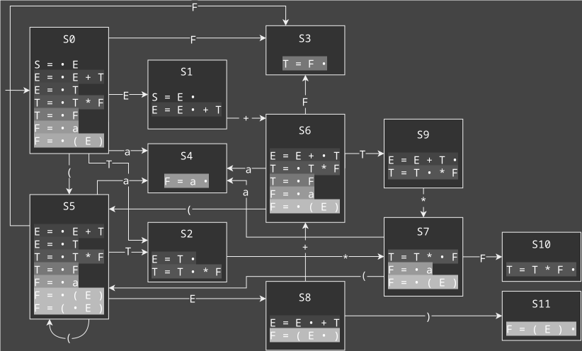
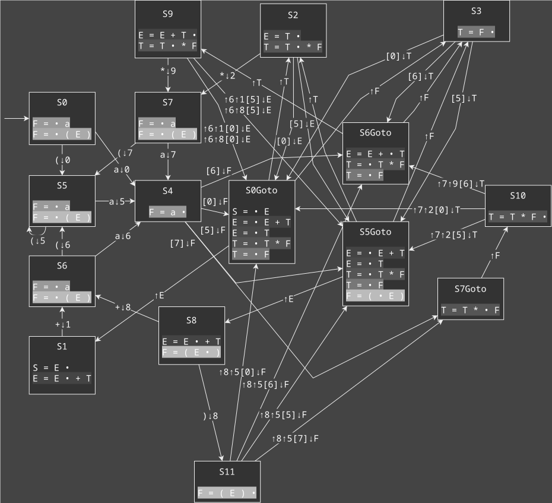
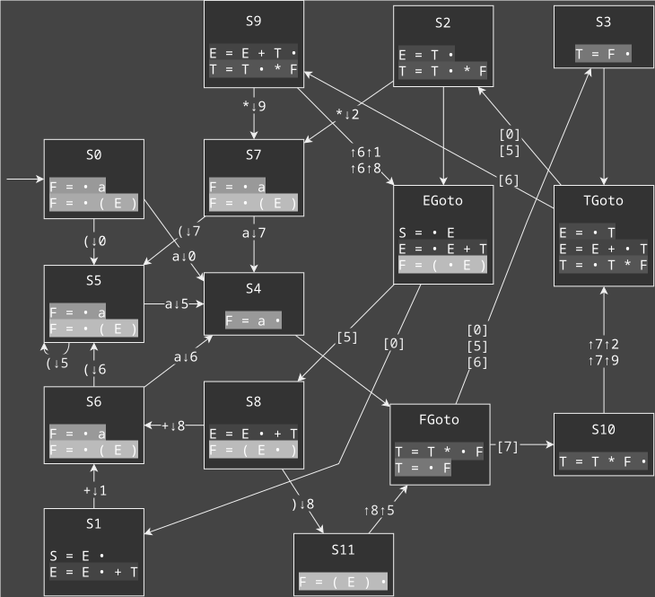
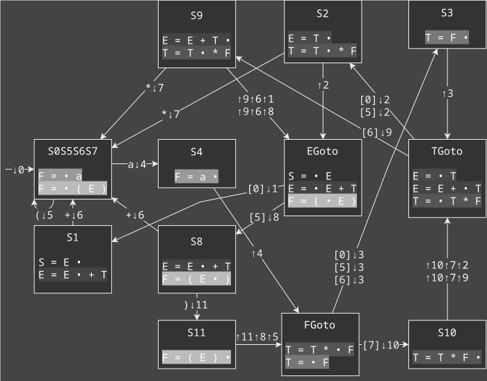
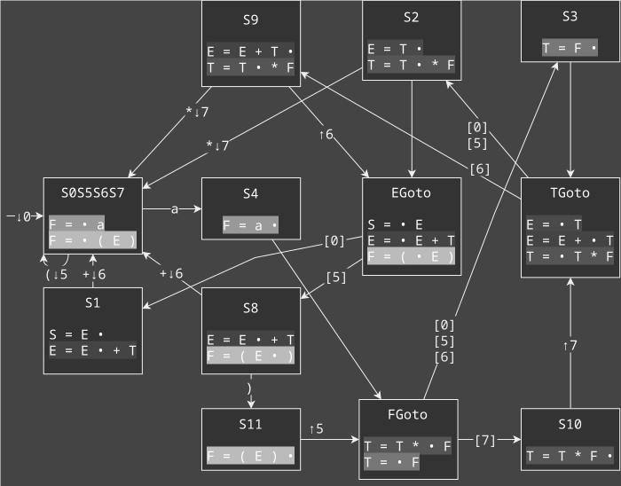
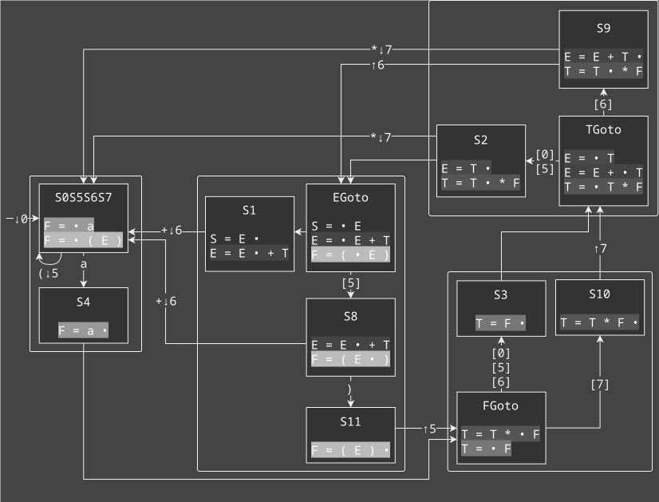
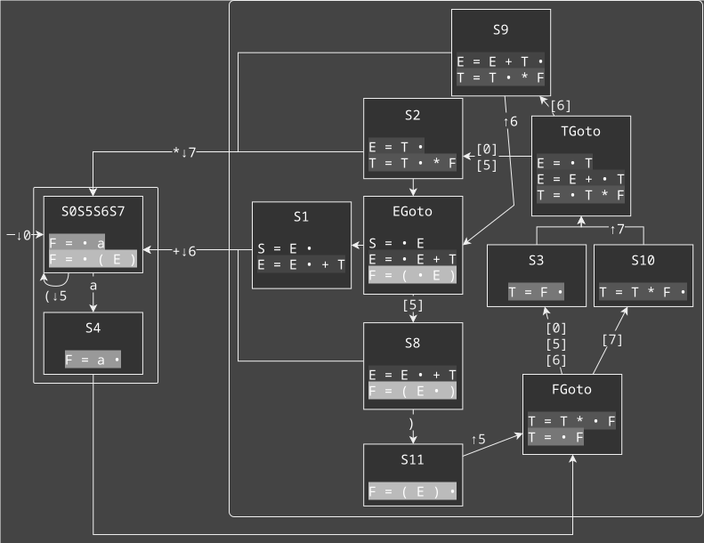

+++
title = "Optimising LR Automata"
date = "2024-11-16"
taxonomies.tags = ["theory of computation", "automata", "context-free grammar", "pda", "parsing"]
+++

I thought I was done with this topic for while, happily planning a new blog post on generalised parsing, but here we are again. This post will be a kind of remix of the [two posts](@/optimising-recursive-ascent/index.md) [on optimising recursive ascent parsing](@/optimising-recursive-ascent-part-2/index.md). Why? Well, I wrote those posts directly based on the papers I refer to in there, and they present their optimisations based on code. At the time that felt quite natural, and I manually applied their ideas and some of my own to code examples. But [when I introduced the topic of LR and recursive ascent in an earlier blog post](@/lr-parsing-recursive-ascent.md), I focussed on _automata_ and making sense of everything _through automata_. And recently I had the idea to try to apply the optimisations from my previous two posts on the automaton itself.

So, we'll be looking underneath the LR automaton at the Push-Down Automaton (PDA)—since that's much closer to the code—and see if we can make sense of the optimisations we did in the previous post through ✨_diagrams_✨[^diagrams].

[^diagrams]: I used to complain at the end of one of these diagram-heavy posts about the time spent making diagrams with GraphViz. I don't understand why I spent so much time with that tool when I could have just grabbed a GUI tool I already knew to build these images as seen above. I suppose I just like the paradigm of text to image, but still, GraphViz is not the right tool for the job here.

# Our Running Example Returns

We'll work with the same example grammar again. The grammar is a simple arithmetic grammar that has been made unambiguous by encoding the precedence relation between multiplication and addition (multiplication binds tighter):

| | |
:- | :-
$S = E$     | (1)
$E = E + T$ | (2)
$E = T$     | (3)
$T = T * F$ | (4)
$T = F$     | (5)
$F = a$     | (6)
$F = ( E )$ | (7)

The LALR automaton for this grammar is:

This time I'm trying out the normal itemset style to see if that makes things better. Upon re-reading my previous posts I wasn't very happy with the shortened versions.

# The State Machine Underneath

In order to see what we're doing to the automaton, we'll need the full PDA with all its stack actions to really see what's going on during our different optimisations, so let's show the hidden actions of an LR automaton in PDA form. I'm going to use the following notation for lookahead for `a` on the input, move past `b` on the input, peek at `C` on the top of the stack, push `D` on the stack, pop `E` off the stack: `(a) b [C] ↓D ↑E`.

Apologies for the rat's nest, I tried my best... At least you can tell from this that an LR automaton is much more efficient at showing the same information. But hey, you can see stack activity now! Take a look at the edge between `S8` and `S11` at the bottom. We're pushing the state number when we shift. Then when we reduce the rule in `S11`, we need the three numbers on the stack that correspond with the three symbol on the right-hand side of the rule. We pop off two, and peek at the last one to decide which `_Goto` state we go to. We also push the non-terminal we reduce onto the stack, and then pop that in the goto to continue to a normal state again.

## Reverse Goto

Now the notable thing here is that the goto states are currently based on a state number (first decision point), and receive the reduced non-terminal on the stack (second decision point). But we have both bits of information at the same time so we could just as well have goto states based on a non-terminal, and receive the state number to make a decision on second. One of the upsides of this strategy is that the state number is already on the stack. Let's see how the PDA looks with that first optimisation:

Holy 💩! I expected some improvement before I made this diagram, but this really cleans up the transitions. Notice how we went from 4 to three goto states, and there is no duplication of LR items in those states. This easier overview also allows us to look at the edges that have multiple lines in their edge label. The edge from `S10` to `TGoto` has 2 different options[^pop-options]. The edge from `TGoto` to `S2` also has two options, but this time we're using them to choosing between that edge and the one going to `S9`. Here the implementation can just pick one of the edges with multiple options and use that as the _default case_. This is safe since we shouldn't end up with another state number on the stack, the options listed are exhaustive.

[^pop-options]: Now an LR automaton gives us the guarantee that we do not have to inspect the things we pop off the stack, we can simply pop twice. Nevertheless, I'm keeping the information in the diagram because I think it make the diagram clearer. Just remember that the only numbers we're really reading off the stack are the ones we use to choose between different output edges. In these diagrams, that's the ones we peek at, not the ones we pop off. 

## Push-First and Merging States

Now we know from last post that if you push the state number first, there are some states you can merge. Perhaps you can already see which ones?

It was `S0`, `S5`, `S6`, and `S7`, which all go to `S5` on a `(` input, and `S4` on an `a` input. By pushing the state that you go to, the actions on their edges are all the same and you can merge the states. A downside of pushing the stack number on before going there, is that we do need to pop an extra stack number off during reduces. Your hands might be itching to cancel out some guaranteed push/pop sequences against each other and remove them (e.g. pushing and popping `4` around state `S4`), but hold your horses. We have a systematic way to dealing with all that...

## Minimal Push Optimisation

The only state numbers in square brackets are `0`, `5`, `6`, and `7`. Those are the only values on the stack we actually use to choose between different outgoing edges. Let's only push those numbers on the stack:

In our simple example this works perfectly. In the general case you may end up with an edge that has two options like `↑6↑7` and `↑7`, because you can end up in the same reducing state through different paths of the automaton. Then the implementation needs to do a conditional pop, or you can duplicate states in the automaton. Refer back to [my first post on optimising recursive ascent](@/optimising-recursive-ascent/index.md#stack-access-minimisation) if you want to have a longer explanation on this optimisation, and if you want to look at the tricks that allow you to remove even more state numbers from the stack.

## Inlining

At this point we can inline almost all states. Here's one attempt that inlines any state that has only one input edge:

Notably, it's the goto states and `S0` that have multiple incoming edges still. But the goto states receive incoming edges from the same single merged state, so you _can_ implement that with a jump in a single place and inline further, merging into two states:

It is unclear to me whether this last step is helpful to performance, but I wanted to show the diagrammatic view of the 2 state automaton we derived in the previous post.

# Conclusion

I'm glad I came back to this topic one more time to inspect the optimisations from a graphical point of view. I think this blog post was much faster to write and hopefully also much easier to read and understand. Not an entirely fair comparison after all the work that went into the previous posts that I refer to throughout, but, well, whatever ¯\\\_(ツ)\_/¯
